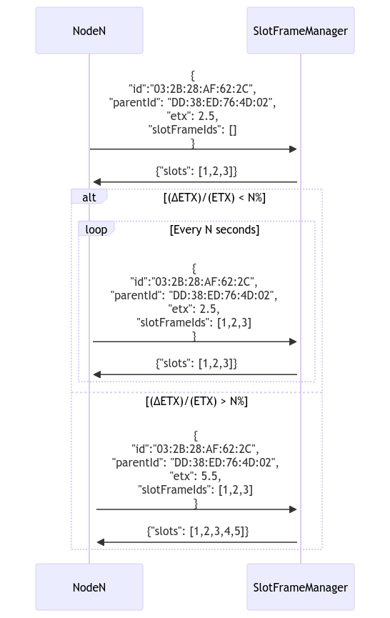

# slotframe-manager

A TSCH slot frame manager designed to work along contiki.

# Specification

## Rationals

The slotframe manager is designed to be the only entity in charge of the slotframe. It is responsible for the allocation of the cells and the management of the slotframe. It is also responsible for
the 

## Payloads

The slotframe manager uses the following payloads:

From 
```json
{
  "id": "03:2B:28:AF:62:2C",
  "parentId": "DD:38:ED:76:4D:02",
  "etx": 2.5,
  "slotFrameIds": [1, 2, 3]
}
```

From the slotframe manager to the node:

```json
{
  "allocatedSlots": [
    1,
    2,
    3
  ]
}

```
