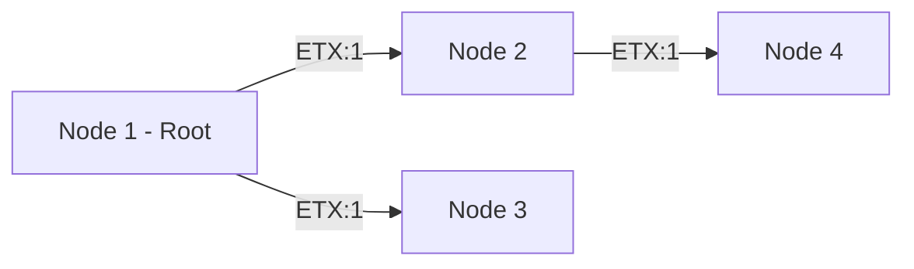
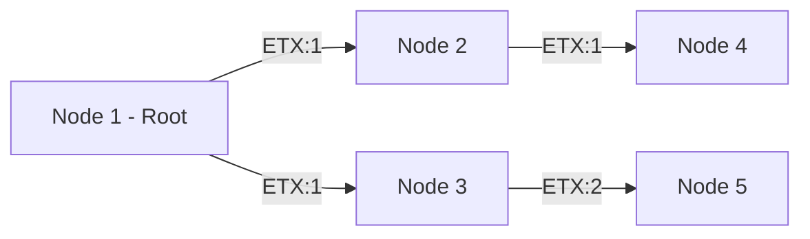
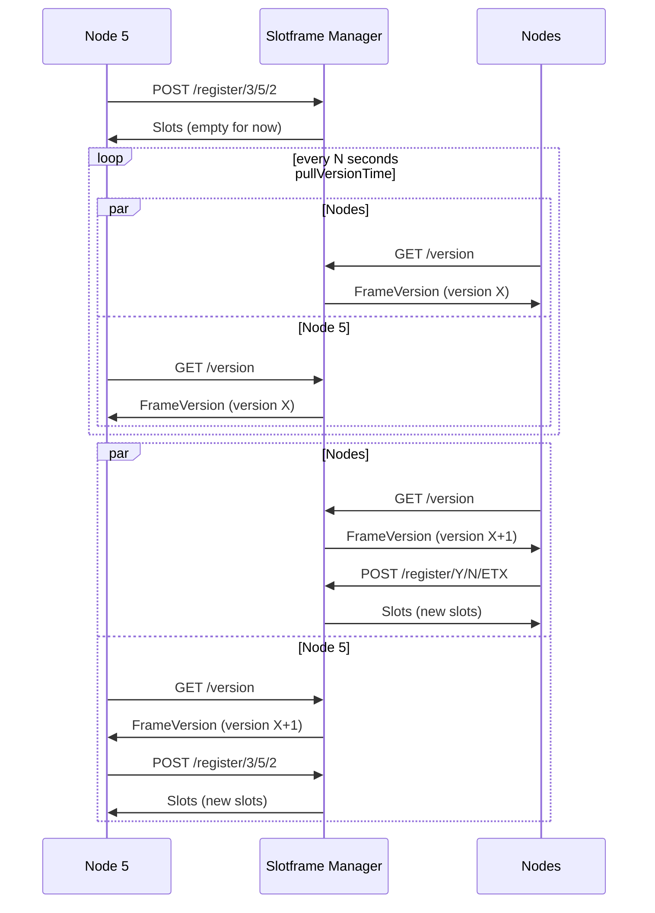
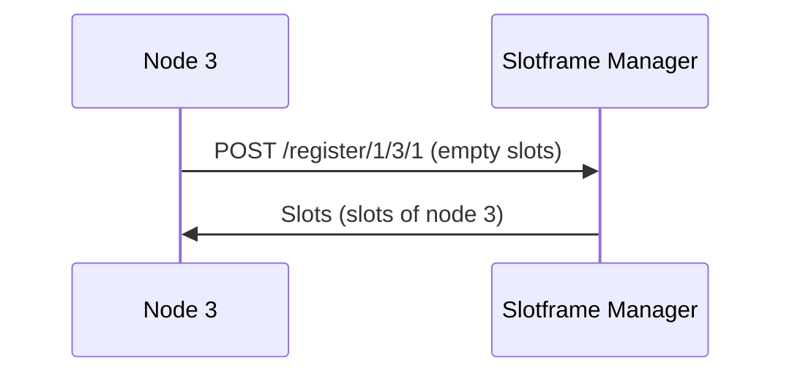
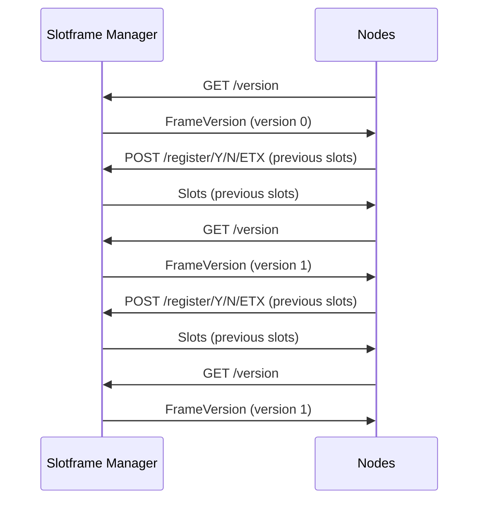

# slotframe-manager

A TSCH slot frame manager designed to work along contiki. This is a part of the LPWAN project at the University of Rennes 1.

### What is here?
The project is divided into two parts:

- The slotframe manager, which is the main part of the project. It is written in Go.
- The contiki node, which is the part that runs on the contiki node. It is written in C and is located in the `contiki-node` folder.


## Requirements

- Go 1.21 or higher (https://golang.org/doc/install).
- For the contiki node, see folder `contiki-node`.

## Installation

```bash
git clone https://github.com/Joffref/slotframe-manager.git
cd slotframe-manager
go mod download
```
## Test out the slotframe manager

Let's say we have the following topology:



To test the slotframe manager, we need to run the following commands, in the following order (in different terminals):

```bash
go run cmd/slotframe-manager/main.go
# "Starting root node"
go run cmd/testclient/main.go run --parentId 0 --id 1 --etx 1
# "Starting child node of root named 2"
go run cmd/testclient/main.go run --parentId 1 --id 2 --etx 1
# "Starting child node of root named 3"
go run cmd/testclient/main.go run --parentId 1 --id 3 --etx 1
# "Starting child node of 2 named 4"
go run cmd/testclient/main.go run --parentId 2 --id 4 --etx 1
```

Then, you should be able to play around. For example, you can try to add a new node to the network:

```bash
go run cmd/testclient/main.go run --parentId 3 --id 5 --etx 2
```

Defining this new topology:



## Configuration

You can configure the slotframe manager by modifying the `config.yaml` file. Here is an example of configuration:

```yaml
address: ":5688" # Address where the slotframe manager will listen
frameSize: 50 # Size of the slotframe (number of slots)
numberCh: 5 # Number of channels in each slot
logLevel: "debug" # Log level (debug, info)
keepAliveInterval: 5s # Interval between two keep alive messages. Written as a duration (https://golang.org/pkg/time/#ParseDuration)
keepAliveTimeout: 30s # Timeout for the keep alive messages. Written as a duration (https://golang.org/pkg/time/#ParseDuration)
```

# Specification

Let's discuss the specification of the slotframe manager.

## Overview
For this project we were supposed to define a protocol to manage the slotframe of a TSCH network.

We made two important choices:
- be stateless
- use CoAP

### Stateless

Being stateless is nice as it allows us to gain in scalability and reduce the complexity of the system. It also allows us to have a simple API.

### CoAP

CoAP is a protocol that is designed to be used in constrained environments. It is based on HTTP and is very simple to use. It is also very well supported by the contiki OS.
Thus, we decided to use CoAP as the underlying protocol for the slotframe manager. Then, we don't have to implement a new protocol and we can focus on the slotframe manager itself.

CoAP will handle the communication between the slotframe manager and the contiki node. Thus, we just define the API of the slotframe manager and CoAP will handle the rest.

## Node lifecycle

The node lifecycle is the following:

- The node is started
- The node registers itself to the slotframe manager
- The node pulls the version of the slotframe
- The node pulls the slots of the slotframe
- The node starts to communicate with the other nodes

### Intervals and timeouts and constants... and more constants

Administator of the network has to define some constants, first on the nodes:
- `pullVersionTime`: the timeout for pulling the version of the slotframe
- `pullSlotsTime`: the timeout for pulling the slots of the slotframe, aka registering to the slotframe manager.

Then, on the slotframe manager:
- `keepAliveInterval`: the interval between two keep alive checks.
- `keepAliveTimeout`: the timeout for a node to be considered as dead. 

## API

The API is defined in the `api` folder. It is a simple CoAP API that allows us to manage the slotframe of a TSCH network.

### Models

The API models are defined in the `api/models.go` file. They are the following:

```go
// Slots is a struct that represents the emitting and listening slots of a node
type Slots struct {
  // EmittingSlots is a map of emitting slots indexed by their slot number
  EmittingSlots map[int]int `json:"emittingSlots"`
  // ListeningSlots is a map of listening slots indexed by their slot number
  ListeningSlots map[int]int `json:"listeningSlots"`
}

// FrameVersion is a struct that represents the version of a frame
type FrameVersion struct {
  // Version is the version of the frame
  Version int `json:"version"`
}
```

### API endpoints

The API is defined as follows:

- `GET /version`: returns the version of the current slotframe.
  - Body: `none` 
  - Response: `FrameVersion`
- `POST /register/{parentId}/{id}/{etx}`: registers a new node to the slotframe manager. The node will be added to the slotframe and will be able to communicate with the other nodes.
  - Body: `Slots`
  - Response: `Slots`


## Usecases

Let's explore the protocol in action to understand more how it works and how our node use the API.

### Adding a new node

Let's say we have the following topology:


We want to add a new node to the network. Let's say we want to add a node 5 to the network. We will use the following command:

```bash
go run cmd/testclient/main.go run --parentId 3 --id 5 --etx 2
```

It will send a `POST /register/3/5/2` request to the slotframe manager. The slotframe manager will then compute the new slotframe and increment the version of the frame. Then, as nodes are pulling the version of the frame, they will be able to see that the frame has changed and will be able to pull the new slots from the slotframe manager (if there is any).


### Hard restart of a node

Let's say we have the following topology:


Let's say we want to restart node 3. We will use the following command:

```bash
go run cmd/testclient/main.go run --parentId 1 --id 3 --etx 1
```

It will send a `POST /register/1/3/1` request to the slotframe manager. the slotframe manager will simply return the in memory slots of the node 3.


### Hard restart of the slotframe manager

Let's say we have the following topology:


Let's say we want to restart the slotframe manager. We will use the following command:

```bash
go run cmd/slotframe-manager/main.go
```

It will send a `GET /version` request to the slotframe manager. The slotframe manager will simply return the version of the frame.



